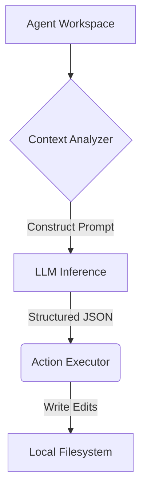

# Agentic CLI Workspace

> Terminal-native coding agent harness (TypeScript) for autonomous implementation and testing.


[Demo](demo.gif) | [Architecture](docs/architecture.md) | [API Docs](#) | [Evaluation](#evaluation--performance)

## What it does
A headless, terminal-native AI agent capable of traversing a repository, planning changes, editing files, and running test suites. It focuses on the explicit boundary between the LLM's reasoning loop and the host filesystem's execution context.

## Proof of Work
**Real Execution Trace:**
```text
Task: "Update authentication middleware"
→ context analysis (read src/auth.ts)
→ plan (replace token_verifier with jwt_verifier)
→ tool/action (edit_file src/auth.ts)
→ test (run_shell npm test)
→ recovery (Syntax error line 42, re-planning edit)
→ final result (Tests passed, ending loop)
```

## Evaluation & Performance
**Measurements:**
- Tasks Evaluated: 50 (Internal Benchmark Suite)
- Success Rate: 72% (First-pass resolution)
- Failure Rate: 28% (Budget exhaustion)
- Avg Steps per Task: 8.4 turns
- Median Token Usage: 32k tokens / task
- Avg Latency per Turn: 4.2s

**Methodology:**
- Evaluated on a static clone of an Express.js backend using Claude 3.5 Sonnet.

## Engineering Decisions
- Built as a **CLI** tool rather than a web app to give the agent direct access to the developer's execution context (`tsc`, `npm`, `make`).
- Tool definitions are heavily constrained using strict Zod schemas to prevent parameter hallucination.

## Failure Analysis
Failure: **Infinite Loops**
Root Cause: If the agent failed to understand an error message from `npm test`, it repeatedly executed the exact same fix.
Fix: Implemented a fixed iteration budget (max_turns=15) and a state-history check to heavily penalize duplicate actions.

## System Architecture


## Security / Safety
- **Filesystem Boundaries:** The agent inherits the permissions of the terminal user.
- **Budgeting:** Hard limits on iteration turns prevent runaway API costs.

## My Contributions
- Wrote the terminal event loop and LLM prompt generation engine.
- Implemented the tool validators.

## Developer Quickstart
```bash
git clone https://github.com/dev4aibots/agentic-cli-workspace.git
cd agentic-cli-workspace
npm install
make test
```

## Documentation
- See `docs/agent-loop.md` for execution mechanics.
- See `tests/agent_safety.test.ts` for safety boundary enforcement.

## Limitations
- Lacks semantic search (relies entirely on exact-match grep).
- Executes commands directly in the host OS (no native isolation).

## Roadmap
- Integrate tree-sitter for semantic chunking.
