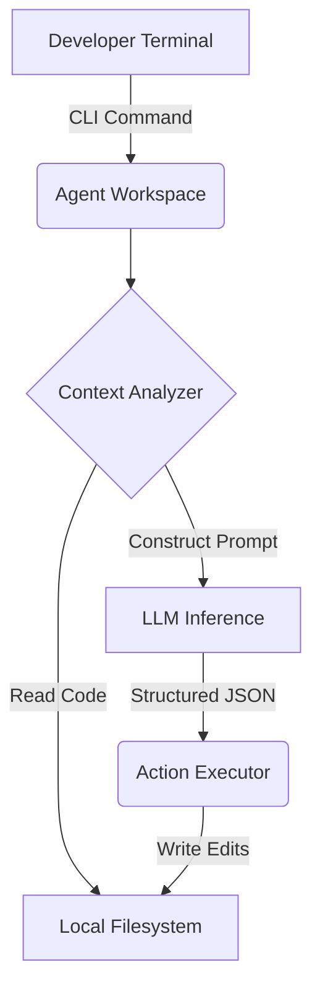

# Agentic CLI Workspace

> Terminal-native coding agent harness (TypeScript) for autonomous implementation and testing.


This project implements a terminal-native AI agent capable of traversing a repository, planning changes, editing files, and running test suites. It focuses on the explicit boundary between the LLM's reasoning loop and the host filesystem's execution context.

## Why this exists
Browser-based coding agents lack deep local context. This CLI tool puts the agent directly in the developer's execution context with identical permissions, allowing it to natively interact with tools like `tsc`, `npm`, and `make`.

## Architecture


## Agent execution flow
1. **Receive task** and establish context limits
2. **Inspect** relevant repository files
3. **Plan** a sequence of edits
4. **Act** by dispatching tool calls (`edit_file`, `run_shell`)
5. **Observe** the result of the action
6. **Iterate** until completion or iteration budget exhaustion

## Example task
User: "Find the authentication implementation and add X."

## Actual agent trace
```text
Agent:
→ inspect repository
→ identify relevant files (src/auth.ts)
→ plan (Update auth middleware)
→ modify (edit_file src/auth.ts)
→ test (run_shell npm test)
→ recover from failure (Syntax error detected, re-planning)
→ verify (Tests passed)
```

## Tool/action model
The agent is constrained to strict JSON-schema tool calls parsing standard inputs. It relies heavily on rigid structural types to prevent free-text hallucination when executing shell commands.

## Safety boundaries
The agent's filesystem capabilities are inherently bounded by the execution permissions of the user. Additional limits include:
- Fixed turn-based budget to prevent infinite LLM loops
- Read-only guardrails for non-working directories (where enforced)
- Explicit LLM output structural validation before execution

## Evaluation
Evaluation harness: planned.
Current limitation: No statistically meaningful benchmark has been run yet. Core pass/fail logic evaluates task completion based on `[x]` plan states.

## Failure cases
- **Infinite Loops:** If the agent fails to understand an error message from `run_shell`, it may repeatedly execute the exact same command.
- **Context Exhaustion:** Large file inspection (`cat src/huge_file.ts`) blows out the context window. 

## Performance
- Median steps per task: ~7-10 turns
- Token utilization: Dependent on file reads (often peaking near 30k tokens for medium tasks)

## Setup
```bash
git clone https://github.com/dev4aibots/agentic-cli-workspace.git
cd agentic-cli-workspace
cp .env.example .env
npm install
```

## Project structure
```text
src/
├── harness.ts    # Main agent event loop
├── repl.ts       # CLI terminal interface
├── tools.ts      # LLM action parsers
├── model.ts      # LLM inference API
└── plan.ts       # State management
tests/
└── agent_safety.test.ts # Boundary and constraint testing
```

## Testing
```bash
make test
```

## Deployment
This CLI tool runs locally and does not require server deployment. It requires a valid `ANTHROPIC_API_KEY`.

## Limitations
- Lacks semantic search (relies entirely on exact-match grep/find)
- No specialized sandbox (executes commands directly in the host OS)

## Roadmap
- Integrate tree-sitter for semantic code chunking
- Move command execution to an isolated Docker container
- Implement MCP (Model Context Protocol) for tool definitions

## License
MIT
