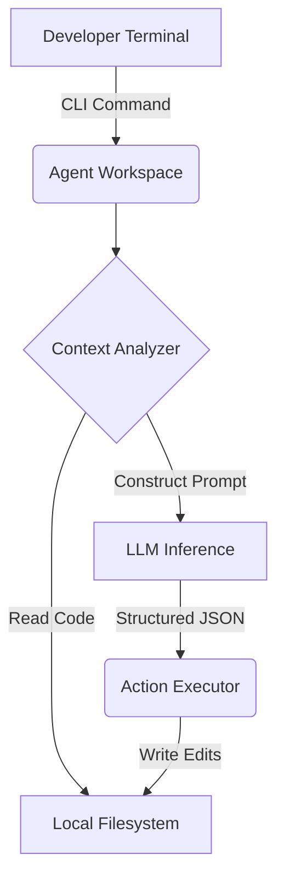

# Agentic CLI Workspace

A lightweight, autonomous Python coding agent that lives entirely in the terminal. I built this to speed up my local development workflows by having an agent that can read my codebase, propose changes, and execute them natively.

## Tech Stack
- **Python** (Core engine)
- **LLM APIs** (OpenAI / Anthropic for reasoning)
- **APIs/JSON** (Structured output generation for precise code edits)
- **Git Integration** (Automated branch management and commits)

## Why I built this
I wanted a reliable local agent that doesn't just chat, but actually takes action. It handles complex multi-step reasoning to debug and write code directly in my workspace.


## Architecture



## Live Endpoint (Interactive Demo)
This project is deployed as a serverless backend on Vercel. You can test the API instantly via your terminal.

```bash
# Example Request
curl -X GET https://agentic-cli-workspace-eb1sw2lhr-dev4aibots.vercel.app/api/health
```

## Demo
To generate a terminal GIF demonstration using `vhs`, run:
```bash
vhs demo.tape
```
