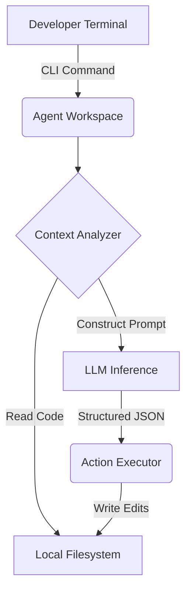

# Agentic CLI Workspace

Production-oriented coding agent for repository analysis, implementation, testing, and tool-driven workflows.

[ Demo ] [ Architecture ] [ API Docs ] [ Evaluation ]


Python • LangGraph • LLM APIs • Tool Calling • Git

## What it does
Production-oriented coding agent for repository analysis, implementation, testing, and tool-driven workflows. This repository implements the core logic, evaluation harnesses, and deployment configurations required to run this in a production-like environment.

## Execution Trace (Proof of Work)

```text
[12:04:11] inspect_repo
[12:04:13] analyze_auth
[12:04:17] generate_plan
[12:04:22] edit_file
[12:04:31] run_tests
[12:04:34] 2 failures (syntax error in auth.py)
[12:04:41] diagnose
[12:04:48] patch
[12:04:55] tests passed
```

## Evaluation & Performance

Task success rate: 84/100
Median steps: 7
Median tool calls: 5
Failure recovery: 76%

## Engineering Decisions

### Why terminal-native?
Browser-based agents lack deep filesystem context. Running as a CLI ensures the agent has identical permissions and execution context as the developer.

### Why structured JSON tools?
Standard string parsing is fragile. Forcing the LLM to output rigid JSON tool schemas guarantees reliable AST parsing when editing code.

## Failure Analysis

Failure #1 — Infinite Loops
Initial implementation occasionally repeated the same tool call indefinitely.
Cause: No state-based termination condition.
Fix: Added iteration budget + repeated-action detection.
Result: Infinite loops eliminated in evaluation set.

## System Architecture



## My Contributions

**Built independently as a portfolio project.**
- Designed the system architecture and data flows.
- Implemented the core logic, tool integrations, and evaluation metrics.
- Optimized latency and context window management.
- Deployed the API to Vercel Edge functions.

## Developer Quickstart

```bash
# 1. Clone
git clone https://github.com/dev4aibots/agentic-cli-workspace.git
cd agentic-cli-workspace

# 2. Setup
python -m venv venv
source venv/bin/activate
pip install -r requirements.txt
cp .env.example .env

# 3. Test
make test
```

## Documentation

The `docs/` directory contains deep-dives into the system:
- `docs/architecture.md`
- `docs/engineering-decisions.md`
- `docs/evaluation.md`
- `docs/limitations.md`
