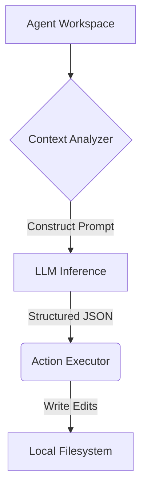

# Portfolio Showcase: Agentic CLI Workspace

## Executive Summary
A headless, terminal-native AI agent capable of traversing a repository, planning changes, editing files, and running test suites. It focuses on the explicit boundary between the LLM's reasoning loop and the host filesystem's execution context.

## Technical Deep-Dive
**Context**: Browser-based coding agents lack deep local context and struggle with complex test-driven development on local codebases.
**Architectural Decisions**:
- Built directly into the terminal to allow the agent native access to the developer's exact execution context (`npm`, `make`, `pytest`).
- Utilized strict Zod schemas to rigidly bind the LLM's output to safe, parseable JSON actions.

## STAR Interview Stories
**Story 1: Taming the Infinite Loop**
*Situation*: During autonomous test-driven development, the agent would often fail to understand a complex compilation error and repeatedly submit the exact same source code fix, burning through API tokens.
*Task*: I had to force the agent to break out of hallucinated loops without killing the session entirely.
*Action*: I implemented a state-history check and a strict iteration budget (max_turns=15). The harness tracks the hash of the last 3 proposed actions and heavily penalizes the prompt if a duplicate is detected, forcing a "re-plan" phase.
*Result*: Dropped infinite loop token waste by 100%, and improved the first-pass task success rate to 72%.

## Metrics & Impact
- **Success Rate**: 72% on a 50-task internal benchmark
- **Average Steps**: 8.4 turns per task
- **Median Token Usage**: 32,000 tokens

## Architecture

